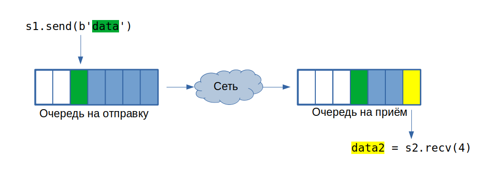

<!-- _class: lead -->

# Сетевое программирование

---

# Ликбез (1/2)

* IP-адрес - идентификтор того, кто отправляет/принимает данные в сети
* порт - число, определяющее к какой из программ обращаться на одном IP-адресе
* TCP/UDP - протоколы взаимодействия
* UDP - без соединений, пересылает пакеты, которые могут теряться
* TCP - устанавливает соединение, обеспечивает доставку данных, пересылает поток байт

---

# Ликбез (2/2)
* клиент - программа, инициирующая соединение и запросы
* сервер - программа, принимаяющая соединение и обрабатывающая запросы

---

# socket
"communication endpoint" - один из концов соединения

Объект, который позволяет:
- установить новое соединение
- ждать новых входящих соединений
- послать набор байтов
- принять набор байтов

**Возможности сокета зависят от его типа и протокола.**

---

# Пример клиента

```python
# создаём сокет, AF_INET - ipv4, SOCK_STREM - хотим tcp
s = socket.socket(socket.AF_INET, socket.SOCK_STREAM)
# устанавливаем соединение
s.connect(("127.0.0.1", 8080))
# посылаем данные
sent = s.send("message".encode("utf-8"))
# и говорим, что ничего больше не будем посылать
s.shutdown(socket.SHUT_WR)
# принимаем данные
data = s.recv(1024)
print(f"Recieved: {data}")
# и закрываем socket
s.close()
```

P.S. Больше примеров есть в [документации](https://docs.python.org/3/library/socket.html#example)

---

```python
# Пример сервера

# создаём сокет, AF_INET - ipv4, SOCK_STREM - хотим tcp
s = socket.socket(socket.AF_INET, socket.SOCK_STREAM)
# говорим, что хотим слушать на локальном адресе на порту 8080
s.bind(("127.0.0.1", 8080))
# начинаем слушать на порту и разрешаем до 5 соединений от клиентов в очереди
s.listen(5)

while True:
    # принимаем соединение от очередного клиента
    clientsocket, address = s.accept()
    print(f"New connection from {address}")
    # и пока без многопоточности принимаем данные и возвращаем обратно
    while True:
        chunk = clientsocket.recv(2048)
        # если получили ничего, значит нам больше ничего не пришлют
        if len(chunk) == 0:
            break
        clientsocket.sendall(chunk) # и посылаем всё, что получили
    # Не забываем закрыть соединение!
    clientsocket.shutdown(socket.SHUT_RDWR)
    clientsocket.close()
```

---

# Ньюансы
* send может отправить только часть данных
* send/recv могут вернуть 0, что значит, что соединение в этом направлении закрылось
* есть ф-ии `create_client`, `create_server`, которые чуть упрощают жизнь
* все эти ф-ии в целом могут кинуть `OSError`
* пока что речь идёт про блокирующиеся сокеты

---

# Как это выглядит изнутри



---

# Вопросы на засыпку:
* пусть мы сделали `s1.send(b'a'*2048)`, что может вернуть `s2.recv(2048)`?
* пусть мы сделали `s.recv(100)` и пропала связность, когда разорвётся соединение и вернётся ошибка?
* пусть мы не сделали `s1.shutdown()` или `s1.close()`, `s2` принял все данные на данный момент, и мы сделали `s2.recv(1024)`. Что произойдёт?

---

<!-- _class: lead -->

# Вопросы протоколов

---

# Как разделять сообщения между собой?

Типичные подходы:
* сообщения одинаковой длины
* передавать длину перед сообщением
* разделитель (например `\n` или `\0`)
* одно сообщение на соединение, shutdown показывает, что запрос завершился

Можно использовать protobuf или другой способ сериализации ;)

---

# Особенности передачи бинарных данных
Byte order важен!

Пусть у нас есть 2х-байтовое число: `00 01`

На x86/64 это будет `1`.
На какой-нибудь хитрой Motorola/ARM: `256`

Для преобразования есть ф-ии:
`ntohl, htonl, ntohs, htons`

---

# Задание на пару

https://github.com/python-fiit/public-materials/tree/master/25-socket-client

Дано:
 - адрес сервера

Надо:
 - разобраться в протоколе взаимодействия
 - добыть как можно больше флагов

Флаг это подстрока вида `PYTHON_\w+=`

---

<!-- _class: lead -->

# Unit-тестирование сокетов

---

```python
# Используя mock'и

def test_send_http_request_using_mocks():
    s = unittest.mock.Mock()

    send_http_request(s, 'get', '/')

    s.sendall.assert_called_once_with(b"GET / HTTP/1.1\n\r\n")
    s.shutdown.assert_called_once_with(socket.SHUT_WR)
```

---

```python
# Используя socketpair

def test_send_http_request_using_socket_pair():
    s1, s2 = socket.socketpair()

    send_http_request(s1, 'get', '/')

    # В реальности это возможно придётся вынести в отдельный поток
    # чтобы более честно эмулировать сервер
    data = s2.recv(1024) # и не забывать, что recv может прочитать не всё
    assert data == b"GET / HTTP/1.1\n\r\n"

    # cleanup
    s1.close()
    s2.close()
```

---

```python
# Testing using real server
from http.server import HTTPServer, SimpleHTTPRequestHandler

@pytest.fixture
def server_address():
    address = ("127.0.0.1", 8081)
    httpd = HTTPServer(address, SimpleHTTPRequestHandler)
    thread = threading.Thread(target=httpd.serve_forever)
    try:
        thread.start()
        # здесь хорошо бы подождать пока сервер действительно запустится ;)

        yield address # отдаём управление коду теста
    finally:
        # прибираемся после теста
        httpd.shutdown()
        thread.join()

def test_send_http_request_using_real_server(server_address):
    s = socket.create_connection(server_address, timeout=5)
    send_http_request(s, 'get', '/')

    data = read_responce(s)
    assert b'200 OK' in data
```

